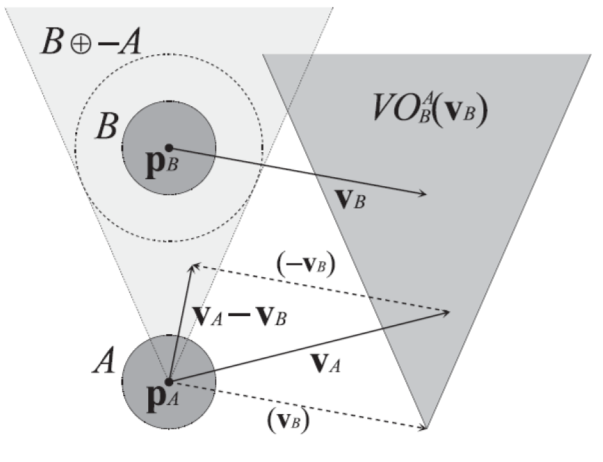
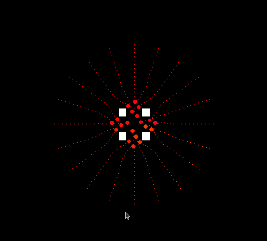

# De-centralized-Multi-Robot-Coordination
This repository contains a project completed at Worcester Polytechnic Institute for the RBE-550 Motion Planning course.

# Overview
The RVO2 (Reciprocal Velocity Obstacles 2) approach is a widely used algorithm in the field of autonomous agent navigation and crowd simulation. It is designed to calculate collision-free and efficient paths for multiple agents moving in a shared environment. The RVO2 approach takes into account the velocities and preferred directions of the agents to compute safe and feasible trajectories, considering both avoidance of collisions and adherence to individual agents' goals.

As for a visualization module, PyGame is a popular library for creating 2D games and visualizations in Python. Integrating PyGame with the RVO2 approach provided a powerful tool for visualizing the behavior and interactions of agents in a simulated environment. By leveraging PyGame's capabilities, we created a graphical representation of the agents, their trajectories, and the obstacles in the environment, allowing for a more intuitive understanding of the RVO2 algorithm in action.

To achieve this, we utilized PyGame's features to draw the agents as discs, visualize their paths, and display the environment with obstacles. Additionally, we implemented interactive elements to control the simulation parameters and observe the real-time behavior of the agents. This integration of RVO2 with PyGame can serve as a valuable tool for studying agent-based systems and crowd dynamics.

# Implementation
You can find the implementation for the same .
